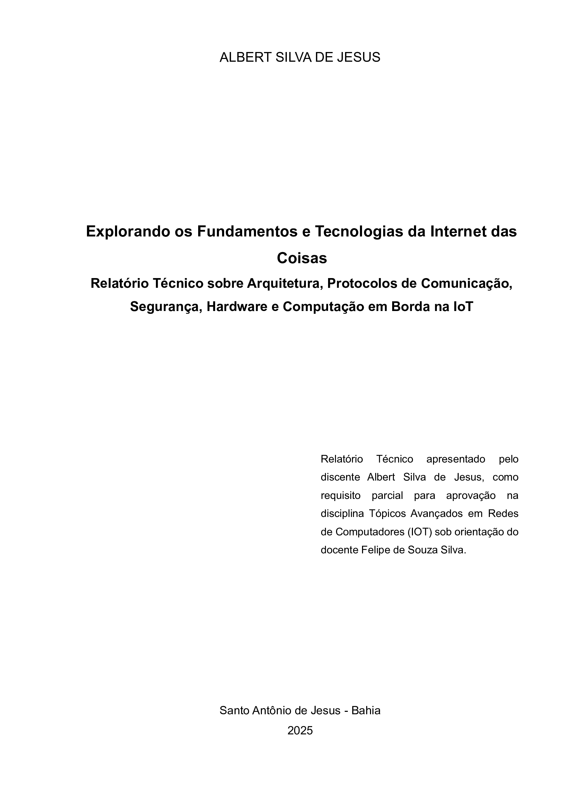
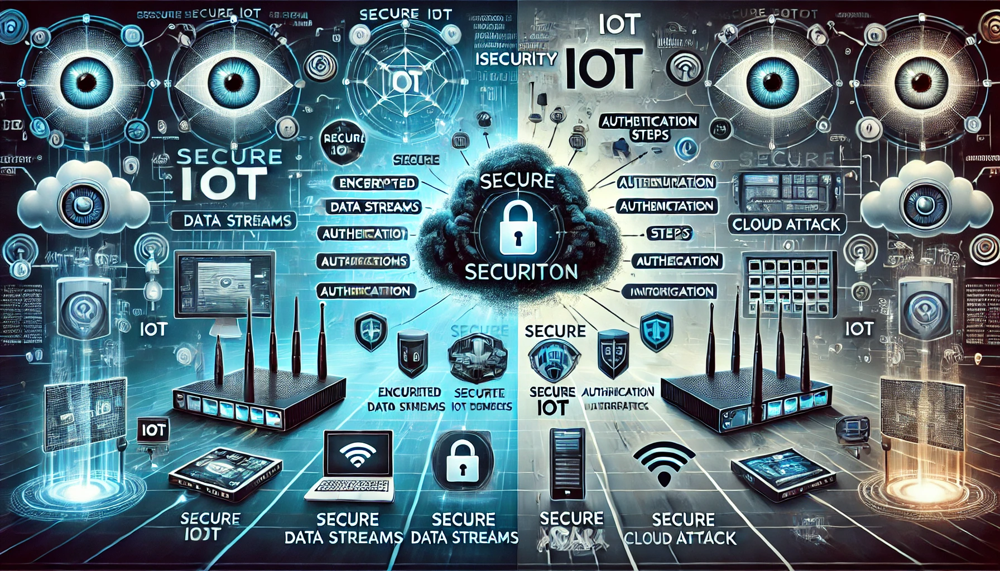

    

    

<h1 align="center">🌐 Tópicos Avançados em Redes de Computadores (IOT) </h1>

## 📌 Objetivo da Atividade:

Aprofundar o entendimento sobre os principais conceitos da `IoT`, desde sua arquitetura e `protocolos` de comunicação até questões de segurança, hardware e computação em borda.

<h2 align="center">📄 Relatório Técnico: Conceitos Fundamentais de IoT</h2>

📝**Introdução**

<table>
  <tr>
    <td></td>
    <td>Nos últimos anos, a <code>Internet das Coisas (IoT)</code> se tornou uma das tecnologias mais importantes do século XXI. Agora, podemos conectar objetos do cotidiano — como eletrodomésticos, carros, termostatos e babás eletrônicas — à Internet por meio de <code>dispositivos</code> incorporados, possibilitando uma comunicação perfeita entre pessoas, processos e outras coisas. Por meio da computação de baixo custo, nuvem, big data, análise avançada e tecnologias móveis, coisas físicas podem compartilhar e coletar dados com o mínimo de intervenção humana. Nesse mundo hiperconectado, os sistemas digitais podem gravar, monitorar e ajustar cada interação entre itens conectados, unindo o mundo físico ao digital e fazendo-os trabalhar em conjunto <a href="https://www.oracle.com/br/internet-of-things/">(ORACLE, 2025)</a>.</td>
  </tr>
</table>

Este relatório revela os fundamentos da `IoT`, desde a arquitetura básica até o `protocolo` de comunicação, segurança, desempenho e o conteúdo abordado, com exemplos práticos relacionados à realidade. a `IoT` não é apenas uma questão de tornar os dispositivos mais inteligentes. Acima de tudo, isso diz respeito ao processo onde ocorre permuta de informações, ocorrendo-a muito mais rapidamente. Além disso, isso muda completamente a maneira como interagimos com o mundo.

💡**1. Conceitos Fundamentais de IoT**

<table style="width: 100%;">
  <tr>
    <td style="width: 100%;">
    </td>
    <td>A Internet das Coisas (IoT) descreve a rede de objetos físicos incorporados a sensores, software e outras tecnologias com o objetivo de conectar e trocar dados com outros dispositivos e sistemas pela internet. Esses dispositivos variam de objetos domésticos comuns a ferramentas industriais sofisticadas <a href="https://www.oracle.com/br/internet-of-things/">(ORACLE, 2025)</a>. 
    A ideia por trás disso é empacotar um monte desses <code>dispositivos</code> que possam coletar informações do ambiente, eles mandam esses dados para um sistema central, que em geral é na <code>nuvem</code>. Lá, os processa e toma medidas baseadas nisso, como ligar seu ar condicionado a casa, apertar o botão das luzes e coisas do tipo. A importância disso é que ela traz <code>eficiência</code>, <code>automação</code> e <code>inovação</code> para diversos setores da sociedade. Desde saúde, ao monitorar pacientes, à agricultura, ao otimizar a colheita e o uso de água, desde as cidades inteligentes, transporte a uso de energia.</td>
  </tr>
</table>

A `arquitetura` de um sistema desse tipo geralmente possui três partes:

- Os `dispositivos` que são os sensores e atuadores.

- Os `gateways` que fazem a ponte entre os dispositivos e a `nuvem` da aplicação.

- A `cloud`, que é onde os dados são armazenados e processados.

E por fim, mas não menos importante, os `aplicativos`, que são as `interfaces` com as quais interagimos, como o `app no celular` ou `painel de controle` de uma empresa ou dona de casa.

Um exemplo de aplicação prática disso é a cidade sob monitoramento de trânsito. `Sensores` nas ruas coletam informações de quantos carros passam e quando e mandam isso pra `nuvem`. Lá, esses dados são processados, e atualizados em tempo real em um painel de controle para uma autoridade de trânsito decidir quem para onde e quando para evitar congestionamento.

🔗**2. Protocolos de Comunicação para IoT**

<table style="width: 100%;">
  <tr>
    <td style="width: 50%;">
      
    </td>
    <td style="width: 50%;">
      Existem dois <code>protocolos</code> principais que são utilizados para permitir a comunicação entre dispositivos <code>IoT</code>. Esses protocolos são: <code>MQTT e CoAP</code>.  
      <ul>
        <li><code>MQTT</code> funciona através de um padrão de <code>publicação/assinatura</code> e é um <code>protocolo</code> perfeito em caso de redes em constante mudança e má largura de banda de <code>dispositivos</code>.</li>
        <li><code>CoAP</code> é um protocolo de <code>roteamento</code> baseado em <code>REST</code> criado especificamente para dispositivos com falta de energia e processamento.</li>
      </ul>
    </td>
  </tr>
</table>

📋**Casos de Uso:**

`MQTT` : monitoramento `remoto` de `equipamentos industriais`, já que a comunicação é essencialmente em tempo real e precisa ser confiável.
`CoAP` : automação residencial, para contornar problemas de uso de energia especialmente com a Internet das Coisas. Quando um interruptor inteligente liga ou desliga as luzes, é necessário que a rede capte instantaneamente o movimento.

🔬**Experimento simples:**

Configurar um `broker MQTT` (como o Mosquitto), para conduzir dados de temperatura de um sensor (como um NodeMCU), para ser exibido em um painel de controle dentro do `Node-RED`. Isso criará uma demonstração das capacidades de tempo real dos protocolos de IoT.

📶**AMQP e LoRaWAN**

<table style="width: 100%;">
  <tr>
    <td style="width: 50%;">
      
    </td>
    <td style="width: 50%;">
      Os protocolos <code>AMQP</code> e <code>LoRaWAN</code> são utilizados em cenários específicos de IoT:
      <ul>
        <li><code>AMQP</code> (Advanced Message Queuing Protocol) Utilizado em sistemas empresariais, oferece segurança e confiabilidade na troca de mensagens.</li>
        <li><code>LoRaWAN</code> (Long Range Wide Area Network) é uma comunicação de longo alcance, tem baixo consumo de energia, ideal para aplicações agrícolas e monitoramento remoto.</li>
      </ul>
    </td>
  </tr>
</table>

⚖️**Comparação e Aplicação**

O `AMQP` é mais robusto. Usado em ambientes corporativos em que a `segurança da informação` é importante.
O `LoRaWAN`, por outro lado, permite que `sensores` em áreas rurais transmitam dados a distâncias de até 15 km, sem a necessidade de uma potência de transmissão alta, tornando-o mais flexível

🔒**3. Segurança e Padronização em IoT**

A segurança é um dos maiores desafios da `IoT`, pois os dispositivos conectados podem se tornar vulneráveis a ataques `cibernéticos`. Os principais problemas da `IoT` em relação à segurança incluem:

- Falta de `criptografia` durante a transferência de dados.

- `Dispositivos` desatualizados acessíveis para ataques.

- Ataques `DDoS` que se aproveitam da rede dos dispositivos `IoT`.

<table style="width: 100%;">
  <tr>
    <td style="width: 50%;">
      
    </td>
    <td style="width: 50%;">
      A segurança é um dos maiores desafios da <code>IoT</code>, pois os dispositivos conectados podem se tornar vulneráveis a ataques <code>cibernéticos</code>. Os principais problemas da <code>IoT</code> em relação à segurança incluem:
      <ul>
        <li>Falta de <code>criptografia</code> durante a transferência de dados.</li>
        <li><code>Dispositivos</code> desatualizados acessíveis para ataques.</li>
        <li>Ataques <code>DDoS</code> que se aproveitam da rede dos dispositivos <code>IoT</code>.</li>
      </ul>
    </td>
  </tr>
</table>

👍**Boas práticas para prevenir**

- Implementação de `criptografia` de ponta a ponta.
- Atualizações frequentes de `firmware` e `software` dos dispositivos.
- Uso de `autenticação` forte para acesso aos dispositivos.

🧑‍💻**Exemplo de Ataque Real**
Em 2016, o ataque `Mirai Botnet` explorou dispositivos `IoT` vulneráveis e criou uma `botnet` massiva para derrubar grandes `servidores` da internet.

📡**Interoperabilidade e Padrões API**
A interoperabilidade na IoT significa que diferentes dispositivos são capazes de se comunicar uns com os outros, independentemente do fabricante.

📡**APIs Padronizadas**
As `APIs` padronizadas é essencial para integrar entre `dispositivos IoT` e serviços que ficam na `nuvem`. Existem três `APIs` amplamente usadas:

- `RESTful APIs` – Baseado em `HTTP` e fácil de integrar e escaláveis.
- `WebSockets` – Permite a comunicação `bidirecional` em `tempo real`.
- `OPC UA` (Open Platform Communications Unified Architecture) é amplamente usada na `indústria` para padronizar a comunicação entre `máquinas`.

💻**4. Hardware e Computação Distribuída**

**Hardware IoT: Sensores e Atuadores**

Os `sensores` e atuadores são componentes fundamentais da `IoT`:

- `Sensores` que adquirem dados do ambiente, como temperatura, umidade e sensores de movimento.
- `Atuadores` que realizam ações a partir dados dos sensores, como motores elétricos, relés de controle.

**Exemplo de Sensor**

<table style="width: 100%;">
  <tr>
    <td style="width: 50%;">
      
    </td>
    <td style="width: 50%;">
      O <code>DHT11</code> é um dos sensores mais utilizados e simples para medir temperatura e umidade em aplicações de <code>automação residencial</code> e <code>sistemas agrícolas</code>.
    </td>
  </tr>
</table>

🌐**Redes de Sensores Sem Fio (WSN)**

- As `WSN` conectam vários sensores à rede para permitir monitoramento em grande escala.

🌾**Aplicação na Agricultura Inteligente**

<table style="width: 100%;">
  <tr>
    <td style="width: 50%;">
      
    </td>
    <td style="width: 50%;">
      Os <code>sensores</code> colocados nas plantações medem a umidade do solo e o nível de nutrientes e enviam os dados para a <code>nuvem</code> para <code>análise</code> e automaticamente acionar o sistema de irrigação.
    </td>
  </tr>
</table>

🧗‍♂️**Desafios de Implementação**

- `Consumo de energia` – Dispositivos devem operar com bateria por períodos longos.
- `Interferência de transmissão` – os locais ao ar livre podem interferir na transmissão.
- `Segurança de dados` – as informações devem ser protegidas contra acessos não autorizados.

**Edge Computing e sua Relação com IoT**

<table style="width: 100%;">
  <tr>
    <td style="width: 50%;">
      
    </td>
    <td style="width: 50%;">
      O <code>Edge Computing</code> processa <code>dados</code> localmente, reduzindo a necessidade de enviar grandes quantidades de informações para a <code>nuvem</code>.
    </td>
  </tr>
</table>

**Vantagens e Desvantagens**

✅ **Vantagens:**

- `Baixa latência` – Respostas mais rápidas em `aplicações` críticas.
- `Menor consumo` de largura de banda – Reduz o tráfego de dados para a `nuvem`.
- `Maior privacidade` – Dados sensíveis podem ser processados localmente.

❌ **Desvantagens:**

- `Capacidade limitada de processamento` – Dispositivos podem ter menos poder computacional.
- `Maior complexidade na manutenção` – Necessidade de atualizações locais frequentes.

**Edge Computing na Segurança e Eficiência da IoT**

- Em `aplicações industriais`, o `Edge Computing` pode processar dados de `sensores` localmente e acionar alertas imediatos em caso de falhas, sem depender da `nuvem`, aumentando a segurança operacional.

**Conclusão:**

<table style="width: 100%;">
  <tr>
    <td style="width: 50%;">
      
    </td>
    <td style="width: 50%;">
      Portanto, desde o setor <code>agrícola</code> até as cidades inteligentes, o <code>IoT</code> é uma tecnologia impactante para os negócios e países. Para concluir, descrevi os quatro principais conceitos, a arquitetura do <code>IoT</code>, os protocolos de comunicação, os problemas de segurança e o hardware. E comparado com exemplos de aplicativos para informações detalhadas sobre como o IoT é usado. Por fim, todo o trabalho de implementação do IoT e sua falta de regulamentação.
    </td>
  </tr>
</table>

## Referências

### Fontes de Texto:

1. ORACLE. _Internet of Things_. Disponível em: [https://www.oracle.com/br/internet-of-things/](https://www.oracle.com/br/internet-of-things/). Acesso em: 8 fev. 2025.
2. IBM. _Internet of Things_. Disponível em: [https://www.ibm.com/br-pt/topics/internet-of-things](https://www.ibm.com/br-pt/topics/internet-of-things). Acesso em: 8 fev. 2025.
3. SAP. _O que é Internet das Coisas (IoT)?_. Disponível em: [https://www.sap.com/brazil/products/artificial-intelligence/what-is-iot.html](https://www.sap.com/brazil/products/artificial-intelligence/what-is-iot.html). Acesso em: 7 fev. 2025.
4. WIKIPEDIA. _Internet das coisas_. Disponível em: [https://pt.wikipedia.org/wiki/Internet_das_coisas](https://pt.wikipedia.org/wiki/Internet_das_coisas). Acesso em: 7 fev. 2025.

### Imagens:

1. TECNERDS. _Imagem ilustrativa sobre IoT_. Disponível em: [https://tecnerds.com.br/wp-content/uploads/2024/01/8fea6228-f617-433b-a3c8-7d82121e1226.jpeg](https://tecnerds.com.br/wp-content/uploads/2024/01/8fea6228-f617-433b-a3c8-7d82121e1226.jpeg). Acesso em: 9 fev. 2025.
2. DUSUN IOT. _Infográfico sobre gateway IoT_. Disponível em: [https://www.dusuniot.com/wp-content/uploads/2022/11/What-is-an-IoT-gateway-infographic-1024x707.jpg](https://www.dusuniot.com/wp-content/uploads/2022/11/What-is-an-IoT-gateway-infographic-1024x707.jpg). Acesso em: 9 fev. 2025.
3. GOOGLE USERCONTENT. _Diagrama de IoT_. Disponível em: [https://lh4.googleusercontent.com/GBXiUJecwe09gPSKAh9EX4c9jW6n_EY4KbXaY6WSx0J2x8WsT6Def6faVIZt7cBYexIA3tpIMFe5LVcN_4zwVZeQYxQnPaWWYdVeNFqMf6-n85bW-24KInTofyVagRtmG6vABxTI](https://lh4.googleusercontent.com/GBXiUJecwe09gPSKAh9EX4c9jW6n_EY4KbXaY6WSx0J2x8WsT6Def6faVIZt7cBYexIA3tpIMFe5LVcN_4zwVZeQYxQnPaWWYdVeNFqMf6-n85bW-24KInTofyVagRtmG6vABxTI). Acesso em: 9 fev. 2025.
4. PSIBORG. _Protocolos de rede IoT_. Disponível em: [https://psiborg.in/wp-content/uploads/2022/01/Iot-network-protocols.webp](https://psiborg.in/wp-content/uploads/2022/01/Iot-network-protocols.webp). Acesso em: 9 fev. 2025.
5. PROESI. _Monitoramento de temperatura em IoT_. Disponível em: [https://proesi.cdn.magazord.com.br/img/2024/08/blog/18672/1/postagem-full/monitoramento-de-temperatura-blog.jpg](https://proesi.cdn.magazord.com.br/img/2024/08/blog/18672/1/postagem-full/monitoramento-de-temperatura-blog.jpg). Acesso em: 9 fev. 2025.
6. COMPRACO. _Ilustração sobre IoT_. Disponível em: [https://compraco.com.br/cdn/shop/articles/out-0_2ee9272e-a3cb-469c-848f-3c453a75c307.png?v=1725643760](https://compraco.com.br/cdn/shop/articles/out-0_2ee9272e-a3cb-469c-848f-3c453a75c307.png?v=1725643760). Acesso em: 9 fev. 2025.
7. RECURSUS. _Gráfico IoT_. Disponível em: [https://recursus.com/wp-content/uploads/2022/06/grafico_v2-1024x576.png](https://recursus.com/wp-content/uploads/2022/06/grafico_v2-1024x576.png). Acesso em: 9 fev. 2025.
8. GLOBO. _Rede de dispositivos IoT_. Disponível em: [https://s2.glbimg.com/11zQeK5ktCo_MwNn4P3GQNyLupQ=/620x430/e.glbimg.com/og/ed/f/original/2018/06/19/network-782707_1280.png](https://s2.glbimg.com/11zQeK5ktCo_MwNn4P3GQNyLupQ=/620x430/e.glbimg.com/og/ed/f/original/2018/06/19/network-782707_1280.png). Acesso em: 9 fev. 2025.

#### 📌 Autor

👨‍💻 **Albert Silva**
